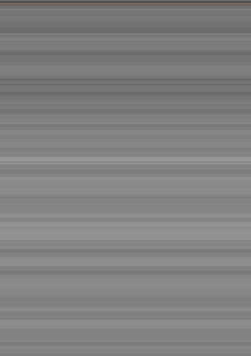
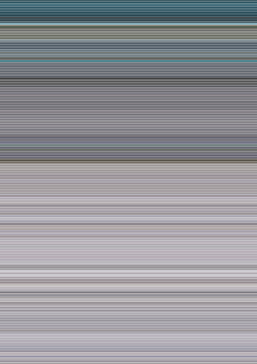

# Pixav

Creates an image made of averaged pixel colors of every frame of a given movie file.

### Dependencies
- [ffmpeg](https://www.ffmpeg.org/)
- libedit
- libpng

#### Build from source
  ~~~ sh
  ./compile.sh
  ~~~

#### Run
  ~~~ sh
  ./pixav /path/to/the/file
  ~~~

### Samples

